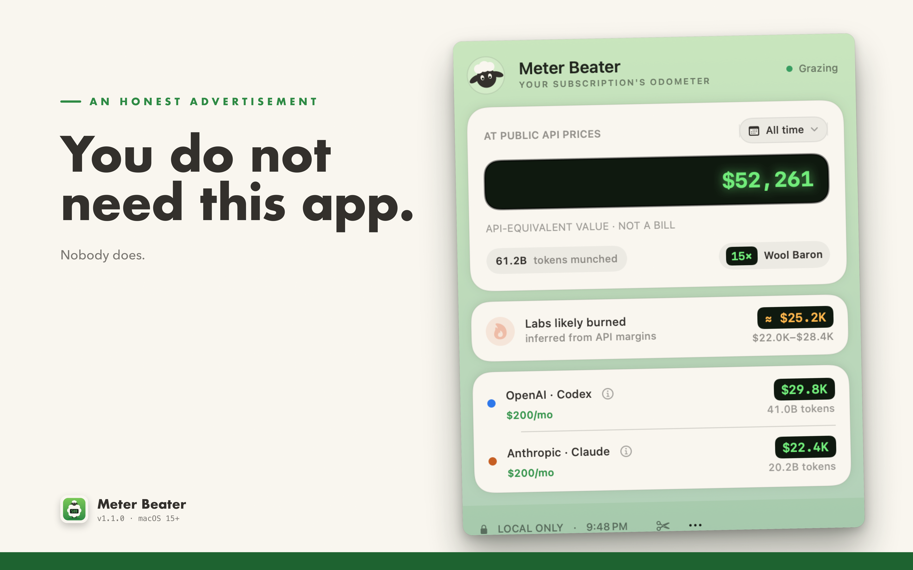

<p align="right"><b>English</b> · <a href="README.zh-Hans.md">简体中文</a></p>

<p align="center"></p>

<h1 align="center">Meter Beater</h1>

<p align="center">A macOS menu bar app that prices your Codex and Claude Code usage at public API rates.<br><b>You do not need this app.</b> Nobody does.</p>

<p align="center">
  <a href="https://github.com/donalddellapietra/meter-beater/actions/workflows/verify.yml"></a>
  <a href="LICENSE"></a>
  
</p>



## What it does

- Opens your local Codex (`~/.codex`) and Claude Code (`~/.claude`) data read-only.
- Prices every token at public API rates and shows the running total in your menu bar. **It is not a bill** — it's what your usage *would have* cost.
- Estimates what serving you likely cost the labs, inferred from their own published margins.
- Assigns you one of ten wool tiers, judged on value extracted per subscription dollar. Click your tier for a Minecraft-style achievement. The low tiers are not compliments.
- Light and dark, English and Simplified Chinese.

## "Doesn't Claude Code already do this?"

`/cost` tells you what's eating your rate limit over the last 7 days, and — because you're on a subscription — carefully shows you no dollars at all. Codex's `/status` counts the session you're sitting in. Neither will tell you what the whole thing was worth, and neither has heard of the other. That's this.

## Install

1. Download `Meter-Beater-<version>-macOS-universal.zip` from [Releases](../../releases/latest).
2. Unzip and drag **Meter Beater.app** into Applications.
3. Open it and look for the ✂️ in your menu bar — if there's no sheep, your menu bar is overcrowded and macOS quietly hid it, so evict an icon you love less.

To quit, open the panel and use the `⋯` menu. Like every menu bar app, the icon can't be ⌘-dragged off the bar — that's macOS, not the sheep.

Requires macOS 15 or later. Universal binary (Apple silicon + Intel), signed and notarized by Apple.

Verify a download:

```sh
shasum -a 256 -c SHA256SUMS
```

## Build from source

The complete app, accounting engine, tests, benchmark, release scripts, and
marketing renderer live in this repository under the MIT License. You need
macOS 15 or later and Xcode with Swift 6 support.

```sh
swift test -Xswiftc -warnings-as-errors
swift run AIUsageTracker
scripts/package-app.sh
```

The package script creates an ad-hoc-signed universal app and ZIP for local
testing. Official downloads use Developer ID signing and Apple notarization;
see [`docs/RELEASING.md`](docs/RELEASING.md).

The accounting and pricing contract is documented in
[`docs/ACCOUNTING.md`](docs/ACCOUNTING.md).

## Privacy

It has seen your 3 a.m. sessions. It will not testify.

The longer version: there is no network code in this app. No accounts, emitted
telemetry, or analytics. It reads local provider data in place, does arithmetic
on your Mac, and writes only its own aggregate cache. Nothing leaves the
machine, because there is nowhere for it to go.

Codex access is limited to transcript directories and read-only thread/model
metadata in `state_*.sqlite`; Meter Beater never opens `~/.codex/auth.json`.
Claude account attribution uses local Claude telemetry and session metadata.
Provider roots are never modified, and manually selected folders receive an
explicitly read-only security-scoped bookmark.

## Contributing and security

Contributions are welcome; start with [`CONTRIBUTING.md`](CONTRIBUTING.md).
Please report vulnerabilities privately as described in
[`SECURITY.md`](SECURITY.md), and never attach real transcripts or credentials
to an issue.

## License

Meter Beater is open source under the [MIT License](LICENSE).

## Fine print

The displayed dollar value is a public API rate-card equivalent, not an invoice, a subscription charge, or an audited cost. Serving-cost figures are directional estimates derived from published analyst margin research. Meter Beater is an independent project and is not affiliated with, endorsed by, or sponsored by OpenAI or Anthropic.
